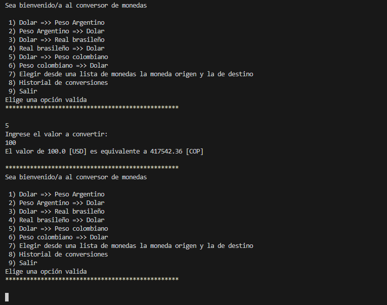
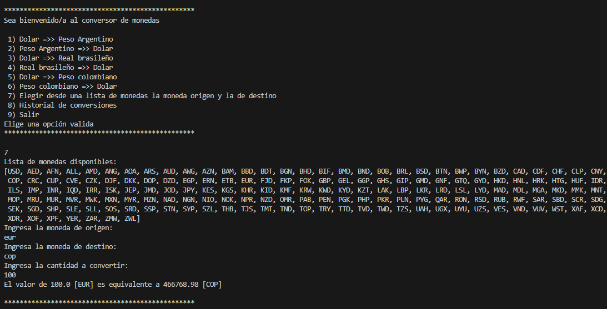
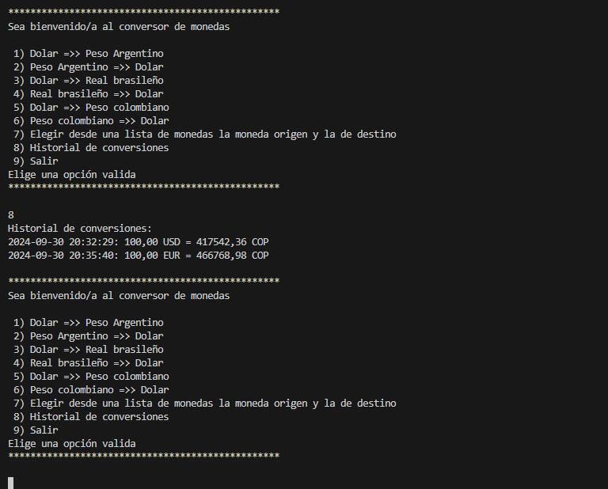

# Conversor de Monedas 💱

## Descripción

Este programa es un conversor de monedas que permite convertir cantidades entre diferentes monedas utilizando una API de conversiones (https://app.exchangerate-api.com/). También mantiene un historial de conversiones realizadas.

## Características ✨

- Convertir entre varias monedas como Dólar (USD), Peso Argentino (ARS), Real Brasileño (BRL), y Peso Colombiano (COP).
- Consultar las tasas de cambio actuales.
- Visualizar el historial de conversiones realizadas.

## Estructura de Carpetas 📂

- `src`: Contiene el código fuente del programa.
  - `ConversionDeMonedas.java`: Clase principal para la conversión de monedas.
  - `Principal.java`: Punto de entrada del programa.
  - `TipoDeCambio.java`: Clase para manejar las tasas de cambio.

## Requisitos 🛠️

- Java 14 o superior
- Conexión a Internet (para acceder a la API de conversiones)

## Ejemplo de uso


*Ejemplo de USD a COP*


*Ejemplo de EUR a COP*


*Ejemplo de ver historial*

## Uso 🚀

1. Clona el repositorio:
   ```bash
   git clone https://github.com/kazuma387/conversor-de-monedas.git
   gh repo clone kazuma387/conversor-de-monedas
